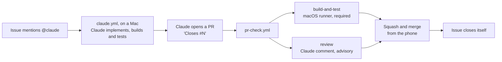

# The Claude pipeline: issue to merged PR from a phone

Open a GitHub issue that mentions `@claude`, and a Claude Code run in GitHub Actions implements it
on a branch, adds tests and opens a pull request that closes the issue. Every pull request then gets
a build-and-test check on a macOS runner, which gates merging, and an advisory Claude review comment
that says what to try on the device. Merging is one tap: Squash and merge.

This repo is the template. To set the same flow up elsewhere, read
[Porting to another repo](#8-porting-to-another-repo) and paste
[`claude-pipeline-setup-prompt.md`](claude-pipeline-setup-prompt.md) into Claude Code there.

## 1. Daily use (from a phone)

**Write the issue.** New issue offers two forms, **Bug report** and **Feature request**
([`.github/ISSUE_TEMPLATE/`](../.github/ISSUE_TEMPLATE/)). They label the issue `bug` or
`enhancement` and ask for what Claude needs: the steps and the expected result for a bug, and for a
feature the change, what must not change, and how you'll know it's done. Their last question, "Hand
it to Claude now?", decides whether the issue starts a run. "Not yet" files it without `@claude`,
and a later comment `@claude fix this` (or `implement this`) starts it. A blank issue works too:
mention `@claude` anywhere. One behavior per issue keeps the PR small enough to review on a phone.
Filter by label to see only bugs or only features:
`https://github.com/<owner>/<repo>/issues?q=is%3Aopen+label%3Abug`.

**Big features: plan first.** A feature too big for one PR you could review on a phone gets
split before anyone writes code. Pick "Yes, but it's big" in the feature form, or comment
`@claude plan this` on any issue. Claude reads the code, opens one sub-issue per piece (each one
behavior, each mergeable alone, in order), links them under the original so it shows a progress
bar, and comments with the plan. It writes no code. Each part then starts like any issue: comment
`@claude implement this` on it, merge its PR, and move on to the next. The parts never start on
their own. Claude splits only when asked, unless the repository variable `CLAUDE_AUTO_SPLIT` is
`true` (Settings → Secrets and variables → Actions → Variables; the phone's browser, not the
GitHub app): then it also splits any issue it judges too big, and `@claude just do it` overrides
that for one issue.

> **Title:** Show when each lift was last trained in the exercise picker
>
> **Body:** @claude In the exercise picker, show "3 days ago" under every exercise that has a
> finished set. An exercise never trained shows nothing, not "never". Take the date from finished
> sessions only, so an in-progress workout doesn't count. Add tests for today, yesterday, across
> midnight, and never trained.

**What happens.**
1. Within a minute, Claude replies on the issue with a progress comment and a checklist it ticks
   off as it works. When it finishes, the comment says how long it took and links the job and the
   branch. The **Actions** tab (on a phone: the repo → Actions) shows every run live, and each
   finished run's summary page has a report with the model, the turns and the duration.
2. After about 5 to 15 minutes, it pushes a `claude/issue-N-...` branch and opens a PR whose body
   says `Closes #N` and ends with a **Test before you merge** checklist: what changed, how risky it
   is, whether you need your phone at all, and the taps to try. Tick the boxes in the PR as you go.
   How Claude writes it, and the part about you that you can edit, is in
   [`.github/claude-test-checklist.md`](../.github/claude-test-checklist.md).
3. `PR Check` starts. The review comment arrives in about 2 minutes. `build-and-test`, the only
   check that blocks merging, runs every unit test in about 10 minutes; `ui-tests` reports later
   (see [timings](#7-timings-observed)).

**Read the review.** The comment's first line is the verdict:

| Verdict | Meaning | What to do |
|---|---|---|
| ✅ Merge | Small, low-risk, tested, and the reviewer is confident it compiles | Merge once `build-and-test` is green |
| ⚠️ Test first | Plausible, but riskier or thinly tested | Install it (`sh scripts/install-phone.sh` from the branch) and follow the "Test on device" checklist |
| ❌ Reject | Wrong, unsafe, or doesn't do what the issue asked | Comment `@claude <what to change>` on the PR, or close it |

The review is advisory. Only `build-and-test` can block a merge.

**When a check fails.** GitHub tells only whoever pushed, and on Claude's branches that is Claude,
so [`claude-check-notice.yml`](../.github/workflows/claude-check-notice.yml) comments on the PR
instead. The comment lists each failed check, says whether it blocks merging, and quotes the failing
tests. If they're in something the PR doesn't touch, re-run the failed jobs first: a UI test can fail
by chance on a slow simulator. Otherwise comment `@claude fix the build`. The notice never starts a
fix by itself. A Claude run that fails before Claude starts says so on its issue too, so a `@claude`
comment never goes unanswered.

**Merge.** Tap **Squash and merge**. To merge without waiting, tap **Enable auto-merge**, and
GitHub merges as soon as `build-and-test` passes. You can merge several PRs one after another:
"require branches to be up to date" is off, so merging one PR doesn't force the next to update.
The merged branch is deleted, and `Closes #N` closes the issue.

**Follow-up commands** (comment them; each starts a new Claude run):

| Where | Comment | Effect |
|---|---|---|
| PR | `@claude fix the build` | Claude reads the failed check's log and pushes a fix to the same branch |
| PR | `@claude <change request>` | Claude amends the PR. A comment on a line of the diff works too |
| Issue | `@claude plan this` | Claude splits the issue into ordered sub-issues and comments with the plan, without writing code |
| Issue | `@claude just do it` | With `CLAUDE_AUTO_SPLIT` on: implement this issue as one PR rather than splitting it |
| PR | `@claude fix the conflicts` | Claude merges the latest `main` into the PR, resolves the conflicts, rebuilds, runs the suites and pushes |
| Issue or PR | `@claude stop` (or `@claude pause`) | Cancels Claude's run there and any wait for the usage limit. The run saves its work as it ends |
| Issue or PR | `@claude continue` | Starts a run that merges the newest saved work (`claude/rescue-<n>-...`) and carries on from it |

**Nothing a run did is lost.** However a run ends (failed, stopped, timed out, or finished with its
push refused), `scripts/claude-pipeline/save-work.sh` runs last, from a copy taken before Claude
started, with git hooks and credential helpers off. It commits what's left, pushes anything not on
GitHub to `claude/rescue-<n>-<run>-<attempt>` (merging `main` first, so a workflow change on `main`
can't get it refused), falls back to an `unsaved-work` artifact, and comments on the issue. The next
run on that issue finds the newest rescue branch and merges it; a finished run deletes the rescue
branches it carried on from.

**Usage limits.** When a run stops on the subscription's limit, the saver leaves a
`claude-usage-limit-<attempt>` artifact. [`claude-retry.yml`](../.github/workflows/claude-retry.yml)
then waits on Linux (`scripts/claude-pipeline/wait-for-reset.sh`): every 20 minutes it asks Opus for
one word, which the limit refuses at no cost, and re-runs the failed job on the first answer. A wait
hands itself on every ~5.5 hours, gives up after 8 days or 6 stopped attempts, and stops on any
other error three times running. The reset time isn't parsed, because the message's wording varies.

**Several issues at once.** One comment starts one run, so comment `@claude implement this` on each
issue you want built; each run gets its own Mac and its own PR. Two or three at a time works best:
- the free plan runs 5 Macs at once, shared with the PR checks (3 per PR), and the rest queue;
- parallel runs use your Claude subscription faster;
- start only parts whose **Depends on** line says "nothing" or names merged parts;
- when two PRs edit the same code, the one merged second conflicts: comment `@claude fix the
  conflicts` on it.

## 2. How it's implemented here

| Component | Where it lives | What it does | Generic or GymTrack-specific |
|---|---|---|---|
| Implement workflow | [`.github/workflows/claude.yml`](../.github/workflows/claude.yml) | Runs Claude (Opus) on `macos-26` when `@claude` appears in a new issue, a comment or a PR review comment | Generic, apart from the runner and the checker |
| Planning instructions | [`.github/claude-planning.md`](../.github/claude-planning.md) | How a run splits an issue into sub-issues instead of implementing it | Generic |
| Test checklist | [`.github/claude-test-checklist.md`](../.github/claude-test-checklist.md) | How every PR's **Test before you merge** section is written, with an "About the owner" part to edit | The format is generic; the owner part and the app's tabs are specific |
| Checker | [`scripts/claude-pipeline/check.sh`](../scripts/claude-pipeline/check.sh) | `check.sh build` compiles all three targets, `check.sh test <Target/Suite>` runs suites; both print only errors and failures. The only build or test command a cloud run may execute; also usable locally | Specific |
| PR workflow | [`.github/workflows/pr-check.yml`](../.github/workflows/pr-check.yml) | `build-and-test` on `macos-26`, plus the Claude review | `build-and-test` steps and the review's app description are specific; the rest is generic |
| Issue forms | [`.github/ISSUE_TEMPLATE/`](../.github/ISSUE_TEMPLATE/) | Bug report and Feature request: apply the label, ask for what Claude needs, and add `@claude` only if you choose "Yes" | Generic structure, GymTrack wording |
| `CLAUDE.md` | [`CLAUDE.md`](../CLAUDE.md) | What every Claude run reads first: layout, data rules, test conventions, CI rules. 60 lines or fewer | Specific |
| Local notes | [`docs/DEVELOPMENT.md`](DEVELOPMENT.md) | Building, phone installs and simulator quirks, kept out of `CLAUDE.md` because cloud runs can't use them | Specific |
| Test targets | `GymTrackTests/`, `GymTrackWatchTests/`, `GymTrackUITests/` | Swift Testing unit tests and XCUITest flows. Every PR extends them | Specific |
| Test host guard | [`GymTrackShared/LaunchMode.swift`](../GymTrackShared/LaunchMode.swift) | Unit-test host gets an in-memory store and no singletons; `-GTUITesting` gives UI tests a clean, quiet app | Specific (the idea is generic) |
| Secret `CLAUDE_CODE_OAUTH_TOKEN` | Repo → Settings → Secrets → Actions | Claude subscription token from `claude setup-token` (valid one year) | Generic |
| Claude GitHub App | github.com/apps/claude, installed on all of the owner's repos | Gives the action a token to push branches, comment and open PRs | Generic |
| Repo settings | [`scripts/claude-pipeline/apply-repo-settings.sh`](../scripts/claude-pipeline/apply-repo-settings.sh) | Squash only, delete merged branches, auto-merge, update suggestions, read-only default token, approval for outside contributors' runs | Generic |
| Saver | [`scripts/claude-pipeline/save-work.sh`](../scripts/claude-pipeline/save-work.sh) | Runs last in every Claude run: saves unfinished or unpushed work to a `claude/rescue-*` branch, notes a usage limit, comments on the issue | Generic |
| Retry workflow | [`.github/workflows/claude-retry.yml`](../.github/workflows/claude-retry.yml) and [`wait-for-reset.sh`](../scripts/claude-pipeline/wait-for-reset.sh) | Waits on Linux for a usage limit to reset, then re-runs the stopped Claude run | Generic |
| Check notice | [`.github/workflows/claude-check-notice.yml`](../.github/workflows/claude-check-notice.yml) and [`check-notice.sh`](../scripts/claude-pipeline/check-notice.sh) | When `PR Check` fails on a `claude/` branch, comments on the PR: the failed checks, whether each blocks merging, the failing tests | Generic (the review job's name, `review`, is in the script) |
| Ruleset | [`scripts/claude-pipeline/ruleset-main.json`](../scripts/claude-pipeline/ruleset-main.json) | On the default branch: require `build-and-test`, block force-pushes and deletion, admins may bypass | Generic (check name is a parameter) |

### Line by line: the parts that aren't obvious

**`claude.yml`**
- The `if:` checks for `@claude` before a runner starts, so ordinary issues and comments cost
  nothing. It also skips anything a bot wrote: a review that quotes `@claude plan this` would
  otherwise start a Mac only for the action to refuse the bot. Issues trigger only on `opened`: editing an old issue to add `@claude` does nothing, so
  comment instead.
- No `allowed_non_write_users`. The action itself refuses anyone without write access, which is
  what keeps strangers on a public repo from spending the subscription.
- `id-token: write` lets the action trade a GitHub OIDC token for a Claude GitHub App token. That
  token pushes the branch and opens the PR, so the PR triggers `pr-check.yml`. A PR opened with the
  default `GITHUB_TOKEN` would not trigger other workflows.
- `additional_permissions: actions: read` lets Claude read CI results, which `@claude fix the build`
  depends on.
- `display_report: "true"` puts a report on the run's summary page: the model, the turns and the
  duration, so a phone can see what ran without reading the raw log. The repo is public, so that
  report is too, the same as the log.
- `Bash(gh pr create:*)`, `Bash(gh pr edit:*)` and the two read-only `view` commands let Claude
  open its PR and keep the checklist current after a follow-up. The action puts its token in `gh`'s
  environment. Its own create-PR tool (`mcp__github__create_pull_request`) runs in Docker, which
  macOS runners don't have: the first run on a Mac reported "the GitHub MCP server didn't connect"
  and could only leave a "Create PR" link.
- `fetch-depth: 0`, `git fetch origin main` (exactly that), `Bash(git merge origin/main:*)`,
  `git merge --abort` and `git status` let `@claude fix the conflicts` work, with the action's own
  `git add`, `git commit` and `git push`. A shallow clone has no common ancestor to merge from, and
  the whole history is a few MB; with full history the action also fetches a PR branch without a
  depth limit. Merging rather than rebasing means the branch is never rewritten, so no force-push
  is needed, and the squash merge flattens the merge commit anyway. The merge is limited to
  `main`. `git diff` and `git log` stay out: their `--output` option writes any file, the
  checker's copy included.
- `persist-credentials: false` on the checkout, so Claude's pushes use the token the action
  writes into the remote URL and arrive as Claude's app. checkout v7 keeps its credential in a
  separate file pulled in by `includeIf`, which the action doesn't remove, and git sent that
  header instead: every push after a PR comment came from `github-actions[bot]`, and GitHub held
  the PR Check it started for the owner's approval. Opening a PR wasn't affected, since `gh pr
  create` already used the app's token. The saver builds its own URL, so it needs nothing saved.
- `runs-on: macos-26`, so the run has Xcode and can build its own change before pushing it. Free
  on a public repo. The limit is 180 minutes, a ceiling for hard bugs that need many build rounds;
  a normal run takes 10 to 30. A run that needs more is usually an issue worth splitting.
- **Install the checker** copies `check.sh` to `$RUNNER_TEMP` before Claude starts. Claude may edit
  any file in the checkout, so a checker it could edit would let it run any command; the copy
  outside the checkout is out of its reach.
- `CLAUDE_CODE_EFFORT_LEVEL: xhigh` runs Opus at its extra-high effort, in the review too.
- `Bash(gh issue create:*)` and `Bash(gh api repos/<repo>/issues/:*)` let a planning run create
  the parts and link them as sub-issues. `gh api` is limited to this repo's issues.
- `${{ vars.CLAUDE_AUTO_SPLIT == 'true' && ... }}` in the system prompt is the toggle: with the
  variable unset, Claude plans only when asked and otherwise implements, noting in the PR if the
  issue should have been split. A variable rather than a code change, so it can be flipped
  between runs without a PR.
- `BASH_DEFAULT_TIMEOUT_MS` and `BASH_MAX_TIMEOUT_MS` raise Claude Code's per-command limit (2
  minutes by default, 10 at most) to 40 minutes, which a cold build needs.
- `Bash(${{ runner.temp }}/check.sh:*)` in `--allowedTools` is the only shell command Claude may
  run besides the git commands the action allows. No pipes, so its output reaches Claude unfiltered
  by anything else; the checker caps it at 40 lines itself.
- `--append-system-prompt` tells Claude how to call the checker, that the build and the suites it
  touched must pass before every push, and to open the PR itself with `Closes #N`, the suites it
  ran and device-test steps.

- `run-name` names each run "Claude on #N", which is how `@claude stop`, the pick-up step and
  the retry workflow find the runs for an issue. It is quoted: YAML reads an unquoted ` #` as the
  start of a comment, which named every run "Claude on" until it was caught.
- **Pick up saved work** looks for the newest `origin/claude/rescue-<N>-*` branch (the checkout has
  every branch, thanks to `fetch-depth: 0`) and passes it to Claude's prompt, which says to merge it
  and carry on rather than redo it. `Bash(git merge origin/claude/rescue-:*)` lets it. The step also
  cancels any wait for the usage limit on the same issue, which would otherwise re-run the old
  run later and race this one; that is why the job has `actions: write`.
- The Claude step has `timeout-minutes: 170`, ten short of the job's 180, so the save step still
  gets time to run when Claude runs long.
- **Save the work** runs `save-work.sh` from the copy taken before Claude started, `if: always()`,
  so it runs after a failure, a cancel or a timeout too. Two artifacts may follow it:
  `claude-usage-limit-<attempt>`, the note the retry workflow looks for, and `unsaved-work-<attempt>`,
  a git bundle kept only if GitHub refused even the rescue branch.
- **Say the run couldn't start** comments on the issue when the job fails before the Claude step
  runs (`steps.claude.outcome == 'skipped'`), for example when the checkout fails. With no
  progress comment and nothing to save, the `@claude` comment would otherwise get no answer.
- The `stop` job runs on Linux when a comment starts with `@claude stop` or `@claude pause` and its
  author is the owner, a member or a collaborator. It cancels every unfinished run named for that
  issue, except itself, and says so if there was nothing to stop. The `claude` job's `if:`
  excludes those comments, so they never start a Mac.

**`claude-retry.yml`**
- Triggered by `workflow_run` when any Claude run completes; the job runs only for a failed one,
  and `wait-for-reset.sh` exits at once unless that attempt left the usage-limit note. The
  attempt number matters: re-runs share a run's artifacts, and an old note mustn't start a wait
  for a newer failure.
- Every 20 minutes it asks Opus, from an empty directory, for one word (`claude -p ... --max-turns
  1`). The limit refuses that at no cost; the first answer means it has reset, and the script
  runs `gh run rerun <id> --failed`. A re-run replays the original comment, so the job behaves as
  if you had commented again, and its pick-up step finds the saved work.
- It asks Opus rather than a cheaper model because limits can apply per model.
- A job may run 6 hours, so after about 5.5 it hands the wait to a fresh run through
  `workflow_dispatch` (a `GITHUB_TOKEN` may start that, unlike other events). It gives up after 8
  days, after an attempt has stopped on the limit 6 times, or after three answers in a row that
  are errors other than the limit (an expired token, say), and comments on the issue each time.
- `concurrency` keeps one wait per stopped run.

**`claude-check-notice.yml`**
- Triggered by `workflow_run` when any `PR Check` completes. The job runs only for a failed
  `pull_request` run on a `claude/` branch of this repo. A fork's branch can carry that name
  too, so the head repository is checked as well.
- It checks out only `scripts/claude-pipeline/` from `main`, never the PR's code, because it
  holds a token that can comment.
- `check-notice.sh` skips a run that isn't on the PR's newest commit, since a newer push has its
  own run. It reads the failed jobs, and asks the ruleset which checks are required, so "blocks
  merging" stays true if the ruleset changes.
- The quoted lines come from `gh run view --log-failed`, filtered the way `check.sh` filters
  (errors, `✘`, failing test cases). Without such lines it quotes the last lines of the failed
  step. Backticks are stripped so a line can't close the code block, and an @-mention inside a
  code block notifies nobody.
- A failed `review` job gets its own line and no `@claude fix the build`, because it says nothing
  about the change.

**`pr-check.yml`**
- `concurrency` with `cancel-in-progress` means a new push to a PR cancels the run for the old
  commit, so a stale red check can't be the one you see.
- `build-and-test` is the job's `name:`, and that name is what the ruleset requires. Renaming the
  job without updating the ruleset leaves every PR waiting for a check that never reports.
- `runs-on: macos-26` is pinned rather than `macos-latest`, so the Xcode under the build only
  changes when this line does. The job prints `xcodebuild -version` first.
- Every Xcode step calls [`check.sh`](../scripts/claude-pipeline/check.sh), the same command a
  Claude run uses on its own change, so CI and Claude build the same way on the same simulators.
  It finds the newest iPhone Pro and 46mm Apple Watch at run time (runner images change their
  device list often, and a hard-coded name breaks without warning), prints only errors and
  failures, and keeps full logs in `build/claude-check/`, which a failed job uploads.
- Inside it: `CODE_SIGNING_ALLOWED=NO`, because simulator builds need no signing and the runner
  has no certificates; `-parallel-testing-enabled NO`, because the unit tests share process-wide
  singletons and parallel runs would clone simulators on a 3-core runner; and
  `-collect-test-diagnostics never`, because by default a failing test makes `xcodebuild` spend
  minutes gathering a simulator report.
- Building the GymTrack scheme also builds the watch app and the widgets, because both are
  embedded in the app.
- **Every unit test gates merging; the UI tests don't.** `build-and-test` runs all of
  `GymTrackTests` and `GymTrackWatchTests`, which hold every unit test the repo has. `ui-tests`
  runs in parallel on its own runner and shows red on the PR when it fails, but the ruleset
  doesn't require it: the flows add ten minutes of building and tapping, and with everything in
  one job the gate once took over 40 minutes.
- The review job saves the PR's diff to `pr.diff` (and a summary to `pr-stat.txt`) before Claude
  starts, from the merge commit and its base (`fetch-depth: 2`), so no API limit applies and Claude
  reads it in parts with Read and Grep. It must post within 25 of its 40 turns, then refine.
- On failure, the checker's logs and the `.xcresult` bundles are uploaded as an artifact for 7 days.
- The review job's `if:` skips PRs from forks. Forks get no secrets, so the job would fail anyway,
  and skipping it keeps a stranger's PR from ever reaching Claude.
- `allowed_bots: "*"`: PRs opened by Claude have `claude[bot]` as the actor, which the action
  rejects by default. This job only comments, so it can't start a loop of runs.
- The review posts with `gh pr comment --edit-last --create-if-none`, so a PR carries one review
  comment that each push rewrites, rather than a pile of them. `Write` is allowed so Claude can put
  the comment in a file for `--body-file`, which survives quotes and line breaks.

## 3. Design decisions and why

- **Squash-only merges.** One commit per PR keeps `main` readable, and Claude's
  work-in-progress commits never land. It also removes the merge-strategy choice from the phone.
- **"Require branches to be up to date" is off.** With it on, every merge would force each other
  open PR to update and rebuild (about 10 minutes) before it could merge. The cost is that two PRs
  that each pass alone could break together. `build-and-test` on the next PR, or on the next push
  to `main`'s PRs, catches that, and here it is a single-user repo with small PRs.
- **The build is the required gate; the review is advisory.** The build is deterministic: it
  compiles or it doesn't. A model's verdict isn't, and a gate that sometimes says no for no
  reason teaches you to bypass gates.
- **Claude opens the PR itself.** Otherwise the run ends with a "Create PR" link, which is one more
  tap and one more page on a phone, and the PR would lack the `Closes #N` and the checklist.
- **The checklist is written by the run that made the change.** It has read every view it touched,
  so it can quote the real labels; the review sees only the diff. Its rules live in a file rather
  than the workflow so the owner can personalise them from a phone, and a change takes effect on
  the next run without touching `claude.yml`.
- **Splitting is on request by default.** A run that decides by itself to plan rather than build
  surprises you on an issue you meant as one piece. So the default is: split only when asked,
  implement otherwise and say in the PR if it should have been split. `CLAUDE_AUTO_SPLIT=true`
  hands that judgement to Claude once you trust it. The parts never start themselves: chaining
  them would need a workflow that starts runs without you, and each part is worth a look first.
- **Opus at `xhigh` effort for both workflows** (`claude-opus-5-5`, `CLAUDE_CODE_EFFORT_LEVEL:
  xhigh` on the action step). Swift that compiles the first time saves build rounds in the
  implementing run, and the reviewer judges a diff it can't build. Both are worth the stronger
  model and the extra thinking, which costs more usage per turn but fewer turns spent going wrong.
- **A public repo**, because GitHub-hosted macOS minutes are free for public repos. The git history
  was scanned for secrets before relying on that (see below).
- **The implementing run builds and tests its own change.** It first ran on `ubuntu-latest`, where
  there is no Xcode, so every compile error surfaced only in CI, a round trip and a fresh Opus run
  (`@claude fix the build`) later. On a Mac with the checker, Claude fixes its own compile errors
  and test failures inside the same run, while it still has the context, and the PR arrives having
  built. CI still runs everything and is still the gate: the run only checks the suites it touched.
  On a private repo the Mac costs 10 times a Linux minute; here it is free.
- **One command, not a shell.** Claude gets the checker rather than `xcodebuild` because the
  checker picks the simulators, keeps the two schemes apart, and turns thousands of log lines into
  the few that matter. Every line Claude reads is usage, so a raw log would cost more than the fix.
- **Unfinished work goes to a branch first.** A branch is something the next run can use with
  one allowed command (`git merge origin/claude/rescue-...`) and you can open on a phone. A run
  can't read an artifact without extra steps, so the git bundle is only the last resort, for when
  GitHub refuses the branch too.
- **Stop is a cancel plus a save.** A job on a runner can't be suspended. Cancelling it saves its
  code, and `@claude continue` starts a run from that code and from the earlier run's progress
  comments. The new run doesn't have the old one's conversation, so it re-reads some files, which
  costs far less than redoing the work.
- **A usage-limit wait asks rather than reads the reset time.** The limit's message changes
  wording ("5-hour limit reached - resets 3pm", "You've hit your weekly limit - resets Jul 25,
  9pm (America/New_York)"), and a parser that stopped matching would wait forever or not at all.
  A one-word question every 20 minutes costs nothing while the limit holds.
- **The wait happens on Linux, the work on a Mac.** A Mac kept waiting would hold one of the five
  a free account may run for hours, and costs ten times as much on a private repo. A re-run, not
  a new comment, restarts the work: a `GITHUB_TOKEN` can re-run a workflow, but a comment it
  posts never starts one.
- **A failed check gets a comment, not a fix.** Starting Claude on every red check would cost a
  run each time a test fails by chance: two UI tests did on one day, on PRs that didn't touch the
  screen they tested. The comment gives the evidence and makes a fix one reply away.

## 4. Security model

- **Only users with write access can trigger Claude.** The action checks the actor's permission.
  Nobody has added `allowed_non_write_users`, and nobody should.
- **Fork PRs get no secrets and no review.** GitHub withholds secrets from fork PRs, and the
  review job's `if:` skips them. `build-and-test` needs no secrets.
- **The default `GITHUB_TOKEN` is read-only.** Each job asks for exactly the permissions it needs.
  `pr-check.yml` defaults to `contents: read`.
- **Fork workflow runs need approval** from the owner, for every outside contributor, not only
  first-timers. A stranger's PR can't run code on a runner until you approve it.
- **The git history was scanned before the repo was relied on as public.** gitleaks scanned all
  267 commits, and a manual search looked for `.env`, `GoogleService-Info.plist`, `.p8`, `.p12`
  and `.mobileprovision` files and hard-coded keys. Nothing was found. The repo was already public.
- **The Claude GitHub App is installed on all of the owner's repos**, by choice. It acts only where
  a workflow calls the action and the repo holds a token secret, which today is only this repo.
- **Prompt injection.** Issue and comment text is the prompt, so text in a thread could try to
  steer Claude. That's acceptable here because:
  - only a write-access user can start a run;
  - the run's token can push branches and open PRs, but `main` is protected by the ruleset;
  - nothing merges without the owner tapping the button after reading the diff;
  - no command Claude may run hands the subscription token to code from the checkout. Apart
    from the checker, those commands are `git` and a few `gh` subcommands, which post only what
    they're given (see "A run can post text" below). The checker lives outside the checkout so
    Claude can't change it, and its first act is to restart itself with an empty environment. Everything it then touches in the checkout (a
    build script phase, a module Python might import, its own simulator cache) runs without the
    token. Python runs isolated (`-I`), and the cache is parsed as data, never run as shell.
  Still, don't trigger `@claude` on a thread where strangers have posted instructions.
- **A run can post text.** It may run `gh pr create`, `gh pr edit`, `gh issue create`, and `gh api`
  against this repo's issues only. With `--body-file` any of these can post a file the run can read,
  and the checkout's `.git/config` holds the run's GitHub token (see below), so a run steered by
  planted instructions could publish it. That token expires within an hour, and only people with
  write access can start a run. An issue a run creates can't start another: the action refuses bot
  actors, and the planning instructions keep the mention out of what it writes.
- **What the checker can't hide.** An empty environment keeps the Claude token out of a build,
  but the action writes that token into the remote URL in `.git/config`, where a build phase Claude
  added could read it. The token can do no more than the run already can (push a branch, open a
  PR, never touch `main`) and expires with the job, so the risk is accepted rather than sandboxed
  away. The checkout saves no credential of its own (`persist-credentials: false`), so the
  workflow's token is never on disk while Claude works.
- **The saver holds the workflow's token after Claude has had the checkout.** It runs the copy
  taken before Claude started, and git runs with hooks, `fsmonitor` and credential helpers off, so
  none Claude planted can run with the token. What remains is the same class of risk as above:
  configuration planted in `.git/config` (a clean filter, say) would run during `git add`. That
  token can push branches, comment, and cancel or re-run workflows, about what the run's own
  token can already do.
- **The retry workflow holds the Claude token.** It checks out only `scripts/claude-pipeline/`
  from `main`, never the stopped run's code, and asks its question from an empty directory. All
  it takes from the stopped run is the issue number in the note, cut down to digits.
- **Only people with write access can stop a run.** The `stop` job checks the comment author's
  association with the repo, so a stranger on this public repo can't cancel your runs.
- **The check notice quotes a log the PR's code wrote.** It runs `main`'s script, never the PR's,
  and only on this repo's `claude/` branches. The quoted lines sit in a code block with backticks
  stripped, so they can't add links or mentions. Its comment is posted with the workflow's
  token, which starts no workflow.

## 5. Costs and limits

- **GitHub minutes.** Free on public repos. On a private repo they come out of the plan's included
  minutes, and macOS minutes count about 10 times a Linux minute. A PR's two Mac jobs,
  `build-and-test` and `ui-tests`, take about 25 minutes together by the
  [timings](#7-timings-observed), plus the implementing run's own Mac time: on a private repo,
  hundreds of included minutes per PR.
- **Concurrent Macs.** A free account runs at most 5 macOS jobs at once. A PR uses two, and an
  implementing run one more, so a second PR's jobs may still queue for a few minutes.
- **Claude usage.** Each implementing run is a long Opus session, and each review a short one,
  both counted against the subscription's usage limits like local Claude Code use. Building and
  testing inside the run adds turns (reading errors and fixing them) but saves the far larger cost
  of a whole new run per `@claude fix the build`. Waiting on a build costs no usage.
- **Reviews.** Every push to a PR runs a new review. `claude setup-token` tokens last one year.
- **Saving and waiting.** Saving takes seconds at the end of the Mac job. A wait for the usage
  limit runs on Linux, free on a public repo and billed at the Linux rate on a private one, for
  up to 6 hours a leg. Once the limit has reset, the question that notices costs one short Opus
  reply.
- **Check notices.** Every `PR Check` run starts a check-notice run. It ends at once as skipped
  unless a check failed on a `claude/` branch, and then takes a few seconds on Linux. It uses no
  Claude usage.
- **For a private repo:**
  - rulesets need GitHub Pro (personal) or Team (organisations); without one, the ruleset call in
    the settings script fails;
  - macOS minutes are billed, so consider running only the unit tests on PRs and the UI tests on
    `main`;
  - the fork-approval setting matters less, since only invited collaborators can open PRs.

## 6. Troubleshooting

| Symptom | Likely cause | Fix |
|---|---|---|
| A plan comment but no sub-issues, or sub-issues not linked | A `gh` command was denied: the allowed patterns in `claude.yml` don't match what Claude ran | The run's log shows the denied command. Link by hand from the parent issue's "Create sub-issue" menu, or comment `@claude link the parts as sub-issues` |
| Claude planned an issue you wanted built | `CLAUDE_AUTO_SPLIT` is `true` and it judged the issue too big | Comment `@claude just do it`, or unset the variable |
| Claude says the checker was denied or timed out | The `--allowedTools` path doesn't match the copy, or the `BASH_*_TIMEOUT_MS` values are gone | Compare `claude.yml` with this document. The run's log shows the exact command Claude tried |
| Nothing happens after opening an issue | `@claude` missing, issue edited rather than opened, author lacks write access, App not installed, secret missing, or `claude.yml` not on `main` | Check the Actions tab. If no run appears, comment `@claude` on the issue. If a run failed, its log names the cause |
| Claude leaves a "Create PR" link instead of a PR | `gh pr create` was denied or failed | Tap the link, or comment `@claude open the pull request`. Check `--allowedTools` in `claude.yml`, and the run's log for the command it tried |
| A PR has no **Test before you merge** section, or an old one | The run skipped `.github/claude-test-checklist.md`, or a follow-up didn't update it | Comment `@claude write the test checklist` |
| The review comment is missing | A fork PR (by design), a draft PR, a missing secret, or the PR changes `pr-check.yml` itself | For a PR that edits `pr-check.yml`, the action refuses to run a workflow that differs from `main`'s copy ("Workflow validation failed"). That's expected: merge it, and later PRs get reviews |
| The build is red | A compile error or failing test, or a UI test that failed by chance on a slow simulator | The check-notice comment quotes the failures. If they're in something the PR doesn't touch, re-run the failed jobs. Otherwise comment `@claude fix the build`. Full logs are in the `*-logs-N` artifact |
| A check is red on Claude's PR and no comment says so | The run was on an older commit, the branch isn't `claude/...`, or `claude-check-notice.yml` isn't on `main` | Open the check's log. The notice's own run (named "Check notice for ...") says why it skipped |
| PR Check on Claude's PR waits for you to approve it | The push came from `github-actions[bot]`, not Claude's app: the checkout saved its own credential again | Approve it this time. Keep `persist-credentials: false` on the checkout in `claude.yml`; the run's "Run actions/checkout" log should show no `extraheader` being written |
| A comment says Claude couldn't start | The job failed before Claude ran, for example a failed checkout | Re-run the job from the linked run, or post the `@claude` comment again |
| The review fails after posting its comment, or never posts | It ran out of turns. Past `--max-turns` the action marks even a posted review failed, and on a large PR the turns can run out before it posts | The prompt asks for the comment within 25 of the 40 turns, and the diff is saved to `pr.diff` so it can be read in parts. If it still happens, raise `--max-turns` in `pr-check.yml`, on `main` too |
| A step hangs for minutes after a test fails | `xcodebuild` collecting simulator diagnostics | `check.sh` passes `-collect-test-diagnostics never`; keep it if you replace the checker |
| The action fails within seconds and the log says nothing | Hidden output: the action shows Claude's log only when asked | Re-running with debug logging isn't enough. Add `show_full_output: "true"`, or set the repository variable `ACTIONS_STEP_DEBUG` to `true`, then remove it: the log can show file contents |
| 401 "OAuth access token is invalid" or "Invalid bearer token" | The token was mangled in the copy: line wraps from the terminal, or the clipboard held the sign-in code instead | Copy the token with nothing else, then `pbpaste \| tr -d '[:space:]' \| gh secret set CLAUDE_CODE_OAUTH_TOKEN --repo <owner/repo>` and clear the clipboard |
| CI can't build what builds locally ("compiling for iOS 15.0" or "unable to type-check this expression") | The runner's Xcode differs from yours. New test targets defaulted to `$(RECOMMENDED_*_DEPLOYMENT_TARGET)`, which each Xcode resolves differently, and an older compiler gives up on long view bodies sooner | Pin deployment targets to numbers; split long view bodies into named properties |
| Merge conflicts | Another PR changed the same lines | Tap **Update branch** if GitHub offers it. Otherwise comment `@claude fix the conflicts` on the PR |
| Claude's push is refused: "refusing to allow a GitHub App to create or update workflow ... without `workflows` permission" | `main` gained a change to a workflow file after the run's branch started, so the branch looks like it changes that workflow, and Claude's app may never touch workflows. The first run on #7 lost its work this way when two pipeline PRs merged mid-run | Claude merges the new `main` and retries once by itself. If that is refused too: for a run with no PR yet, comment `@claude implement this` again; for a PR, tap **Update branch** yourself, then comment `@claude` again. Avoid merging workflow changes while a run is going |
| "Workflow initiated by non-human actor" | A bot opened the PR or comment | `allowed_bots: "*"` on the review job covers Claude's PRs. Never add it to `claude.yml` |
| A comment says Claude stopped and its work is on `claude/rescue-...` | The run failed, was stopped, timed out, or its push was refused. The comment says which | Comment `@claude continue`. To start over instead, say so in the comment. Delete old rescue branches from the branches page whenever you like; a run that finishes deletes the ones it carried on from |
| `@claude stop` says there's nothing to stop while a run is going | The run isn't named "Claude on #N" (runs before the run-name fix were all named "Claude on") | Open the run in the Actions tab and tap **Cancel workflow** |
| Claude hit the usage limit and nothing restarted it | The run predates the retry workflow, the usage-limit note is missing, or the wait gave up (it comments why) | While a wait is going, the Actions tab shows "Waiting to retry Claude on #N". Otherwise comment `@claude continue` once your limit has reset |
| A comment says the work is in the run's artifacts as `unsaved-work` | GitHub refused even the rescue branch | Download the artifact from the run page. On a Mac, `git fetch unsaved-work.bundle HEAD:recovered` and push `recovered`, or ask a local Claude session to do it |
| 401 or "OAuth token has expired" in the action log | The year-long token expired or was revoked | Run `claude setup-token` in Terminal.app, then `gh secret set CLAUDE_CODE_OAUTH_TOKEN --repo <owner/repo>` |

## 7. Timings observed

From the runs on the setup PR (`macos-26`, Xcode 26.6, October 2026):

| Step | Time |
|---|---|
| `build-and-test` (the gate) | 9 minutes: 3 to build all three targets, 6 for the unit tests |
| `ui-tests` | 14 minutes, building included |
| Picking simulators | 7 seconds |
| Before the split: iPhone build, then unit and UI tests, in one job | 16 minutes |
| Watch build and unit tests | 2.6 minutes |
| Claude review | 1.5 minutes and 17 turns on a normal diff; 2.6 minutes on this PR's very large one |
| `check.sh` on a warm build (a MacBook) | 36 seconds to rebuild all three targets; 22 seconds for one suite |

The one-job layout passed the 40-minute limit, which is why the gate holds only the build and the
unit tests. The implementing run's time depends on the issue; its summary page reports it.

## 8. Porting to another repo

1. Copy `.github/workflows/claude.yml`, `.github/workflows/pr-check.yml`,
   `.github/workflows/claude-retry.yml`, `.github/workflows/claude-check-notice.yml`,
   `.github/ISSUE_TEMPLATE/`, `.github/claude-planning.md`,
   `.github/claude-test-checklist.md` and `scripts/claude-pipeline/` into the new repo. Reword the issue forms' examples for that app, and rewrite the checklist's
   "About the owner" part and its tab names.
2. Replace the `build-and-test` steps for the new stack, keeping the job name. For example:
   - Xcode: `xcodebuild test -scheme App -destination "id=$SIM_ID" CODE_SIGNING_ALLOWED=NO` on `macos-26`
   - Node: `npm ci && npm test` on `ubuntu-latest`
   - Python: `pip install -e '.[test]' && pytest` on `ubuntu-latest`
   - Unity: `game-ci/unity-test-runner@v4` with a `UNITY_LICENSE` secret, on `ubuntu-latest`
3. Rewrite the checker for the new stack. `check.sh` is Xcode-specific: it picks simulators and
   runs `xcodebuild`. Keep its shape (`check.sh build`, `check.sh test <names>`, only errors
   printed, full logs under `build/claude-check/`, the restart under `env -i`) and replace the
   commands inside. Then reword the checker sentence in `claude.yml`'s `--append-system-prompt`
   ("compiles all three targets", the `GymTrackTests/SomeSuite` example), and set `runs-on` to
   `ubuntu-latest` if the stack doesn't need a Mac. If the runner can't build the project at all,
   take the checker out of `--allowedTools` and the prompt, and say in `CLAUDE.md` that CI checks.
   `save-work.sh`, `wait-for-reset.sh` and `check-notice.sh` work in any repo, provided the
   review job keeps its name, `review`. `wait-for-reset.sh` names the model
   it asks, so keep that the same as `--model` in `claude.yml`.
4. Rewrite the app description in the review prompt, and the "Test on device" wording if the
   project has no device.
5. Write that repo's `CLAUDE.md`, 60 lines or fewer: what the app is, the folder map, test
   conventions, how a cloud run checks its work (the checker, or "CI does" when the runner can't
   build), and the rule that pipeline changes update its
   copy of this document.
6. Install the Claude GitHub App on the repo. Run `claude setup-token` in Terminal.app, then
   `gh secret set CLAUDE_CODE_OAUTH_TOKEN --repo <owner/repo>`.
7. Run `sh scripts/claude-pipeline/apply-repo-settings.sh <owner/repo> build-and-test`.
8. Push the four workflows to the default branch first. The review refuses to run from a
   workflow file that differs from the default branch's copy, and comment- and `workflow_run`-
   triggered workflows only ever run from the default branch.
9. Verify with a small test PR (check and review both appear), then with a test issue from the phone,
   and on that issue `@claude stop` while it works and `@claude continue` after.

## 9. What was built here, and how it differs from the setup prompt

- **Existing tests ported.** The repo already had an older suite outside the Xcode targets. #6
  ported every assertion in it to Swift Testing in ten parts and deleted it, so every test now
  lives in the Xcode targets and runs in the gate.
- **`CLAUDE.md` split.** The old 180-line file became a 60-line `CLAUDE.md` plus
  `docs/DEVELOPMENT.md`, which holds everything only a local session can use.
- **`actions/checkout@v7`** rather than `@v6`, because v7 is current.
- **`macos-26` pinned** rather than `macos-latest`. Its default Xcode, 26.6, builds the project,
  which uses no iOS 26 or 27 APIs.
- **Only the unit tests gate merging.** The prompt allowed moving UI tests out once the gate passed
  about 15 minutes; with everything in one job it passed 40. So the gate builds all three targets
  and runs every iPhone and watch unit test, while `ui-tests` runs in parallel as a check that
  isn't required. Failed jobs upload their logs.
- **The implementing run is on a Mac and builds and tests its own change** with
  `scripts/claude-pipeline/check.sh`. The prompt had it on Linux with CI as the only compiler.
- **Claude opens its PR with `gh pr create`.** The action's create-PR tool runs in Docker, which
  macOS runners don't have.
- **Added after the setup:** the test checklist on every PR, planning into sub-issues, `@claude fix
  the conflicts`, saving unfinished work, `@claude stop` / `@claude continue`, the wait for a
  usage limit (`claude-retry.yml`), and the comments when a check fails on Claude's PR
  (`claude-check-notice.yml`) or a run can't start.
- **The review posts with `--edit-last --create-if-none`** and may use `Write` for the comment body.
- **The workflows were pushed to `main` before the setup PR**, because the review refuses to run
  from a workflow file that doesn't match `main`'s copy.
- **The repo was already public** with `main` as default, so nothing was created or renamed.
- **Repo settings were applied by the owner** running `apply-repo-settings.sh`. The agent doing
  the setup isn't allowed to change a repo's security settings itself.
- **The Claude App is on all repos** rather than only this one, by the owner's choice.
- **Testability changes to the app:** `LaunchMode` and its guards (in-memory store and no
  singleton setup in a test host; a clean, prompt-free app for UI tests), `AppSchema.models`, four
  accessibility identifiers, and `WatchBridge.handle(_:)` made internal.
