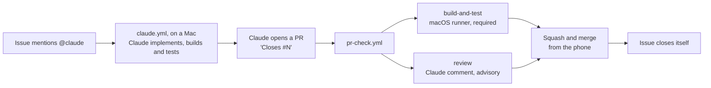

# The Claude pipeline: issue to merged PR from a phone

Open a GitHub issue that mentions `@claude`, and a Claude Code run in GitHub Actions implements it
on a branch, adds tests and opens a pull request that closes the issue. Every pull request then gets
a build-and-test check on a macOS runner, which gates merging, and an advisory Claude review comment
that says what to try on the device. Merging is one tap: Squash and merge.

This repo is the template. To set the same flow up elsewhere, read
[Porting to another repo](#8-porting-to-another-repo) and paste
[`claude-pipeline-setup-prompt.md`](claude-pipeline-setup-prompt.md) into Claude Code there.

## 1. Daily use (from a phone)

**Write the issue.** New issue offers two forms, **Bug report** and **Feature request**
([`.github/ISSUE_TEMPLATE/`](../.github/ISSUE_TEMPLATE/)). They label the issue `bug` or
`enhancement` and ask for what Claude needs: the steps and the expected result for a bug, and for a
feature the change, what must not change, and how you'll know it's done. Their last question, "Hand
it to Claude now?", decides whether the issue starts a run. "Not yet" files it without `@claude`,
and a later comment `@claude fix this` (or `implement this`) starts it. A blank issue works too:
mention `@claude` anywhere. One behavior per issue keeps the PR small enough to review on a phone.
Filter by label to see only bugs or only features:
`https://github.com/<owner>/<repo>/issues?q=is%3Aopen+label%3Abug`.

> **Title:** Show when each lift was last trained in the exercise picker
>
> **Body:** @claude In the exercise picker, show "3 days ago" under every exercise that has a
> finished set. An exercise never trained shows nothing, not "never". Take the date from finished
> sessions only, so an in-progress workout doesn't count. Add tests for today, yesterday, across
> midnight, and never trained.

**What happens.**
1. Within a minute, Claude replies on the issue with a progress comment and a checklist it ticks
   off as it works. When it finishes, the comment says how long it took and links the job and the
   branch. The **Actions** tab (on a phone: the repo → Actions) shows every run live, and each
   finished run's summary page has a report with the model, the turns and the duration.
2. After about 5 to 15 minutes, it pushes a `claude/issue-N-...` branch and opens a PR whose body
   says `Closes #N` and has a "How to test on device" section.
3. `PR Check` starts. The review comment arrives in about 2 minutes. `build-and-test`, the only
   check that blocks merging, takes about 10 minutes; `ui-tests` and `script-tests` report later
   (see [timings](#7-timings-observed)).

**Read the review.** The comment's first line is the verdict:

| Verdict | Meaning | What to do |
|---|---|---|
| ✅ Merge | Small, low-risk, tested, and the reviewer is confident it compiles | Merge once `build-and-test` is green |
| ⚠️ Test first | Plausible, but riskier or thinly tested | Install it (`sh scripts/install-phone.sh` from the branch) and follow the "Test on device" checklist |
| ❌ Reject | Wrong, unsafe, or doesn't do what the issue asked | Comment `@claude <what to change>` on the PR, or close it |

The review is advisory. Only `build-and-test` can block a merge.

**Merge.** Tap **Squash and merge**. To merge without waiting, tap **Enable auto-merge**, and
GitHub merges as soon as `build-and-test` passes. You can merge several PRs one after another:
"require branches to be up to date" is off, so merging one PR doesn't force the next to update.
The merged branch is deleted, and `Closes #N` closes the issue.

**Follow-up commands** (comment them; each starts a new Claude run):

| Where | Comment | Effect |
|---|---|---|
| PR | `@claude fix the build` | Claude reads the failed check's log and pushes a fix to the same branch |
| PR | `@claude <change request>` | Claude amends the PR. A comment on a line of the diff works too |
| Issue | `@claude redo this on latest main` | For a PR that conflicts: Claude starts again from current `main` |

## 2. How it's implemented here

| Component | Where it lives | What it does | Generic or GymTrack-specific |
|---|---|---|---|
| Implement workflow | [`.github/workflows/claude.yml`](../.github/workflows/claude.yml) | Runs Claude (Opus) on `macos-26` when `@claude` appears in a new issue, a comment or a PR review comment | Generic, apart from the runner and the checker |
| Checker | [`scripts/claude-pipeline/check.sh`](../scripts/claude-pipeline/check.sh) | `check.sh build` compiles all three targets, `check.sh test <Target/Suite>` runs suites; both print only errors and failures. The one command a cloud run may execute; also usable locally | Specific |
| PR workflow | [`.github/workflows/pr-check.yml`](../.github/workflows/pr-check.yml) | `build-and-test` on `macos-26`, plus the Claude review | `build-and-test` steps and the review's app description are specific; the rest is generic |
| Issue forms | [`.github/ISSUE_TEMPLATE/`](../.github/ISSUE_TEMPLATE/) | Bug report and Feature request: apply the label, ask for what Claude needs, and add `@claude` only if you choose "Yes" | Generic structure, GymTrack wording |
| `CLAUDE.md` | [`CLAUDE.md`](../CLAUDE.md) | What every Claude run reads first: layout, data rules, test conventions, CI rules. 60 lines or fewer | Specific |
| Local notes | [`docs/DEVELOPMENT.md`](DEVELOPMENT.md) | Building, phone installs and simulator quirks, kept out of `CLAUDE.md` because cloud runs can't use them | Specific |
| Test targets | `GymTrackTests/`, `GymTrackWatchTests/`, `GymTrackUITests/` | Swift Testing unit tests and XCUITest flows. Every PR extends them | Specific |
| Test host guard | [`GymTrackShared/LaunchMode.swift`](../GymTrackShared/LaunchMode.swift) | Unit-test host gets an in-memory store and no singletons; `-GTUITesting` gives UI tests a clean, quiet app | Specific (the idea is generic) |
| Script tests | `Tests/` + [`scripts/test-all.sh`](../scripts/test-all.sh) | The older swiftc suite, also run by `build-and-test` | Specific |
| Secret `CLAUDE_CODE_OAUTH_TOKEN` | Repo → Settings → Secrets → Actions | Claude subscription token from `claude setup-token` (valid one year) | Generic |
| Claude GitHub App | github.com/apps/claude, installed on all of the owner's repos | Gives the action a token to push branches, comment and open PRs | Generic |
| Repo settings | [`scripts/claude-pipeline/apply-repo-settings.sh`](../scripts/claude-pipeline/apply-repo-settings.sh) | Squash only, delete merged branches, auto-merge, update suggestions, read-only default token, approval for outside contributors' runs | Generic |
| Ruleset | [`scripts/claude-pipeline/ruleset-main.json`](../scripts/claude-pipeline/ruleset-main.json) | On the default branch: require `build-and-test`, block force-pushes and deletion, admins may bypass | Generic (check name is a parameter) |

### Line by line: the parts that aren't obvious

**`claude.yml`**
- The `if:` checks for `@claude` before a runner starts, so ordinary issues and comments cost
  nothing. Issues trigger only on `opened`: editing an old issue to add `@claude` does nothing, so
  comment instead.
- No `allowed_non_write_users`. The action itself refuses anyone without write access, which is
  what keeps strangers on a public repo from spending the subscription.
- `id-token: write` lets the action trade a GitHub OIDC token for a Claude GitHub App token. That
  token pushes the branch and opens the PR, so the PR triggers `pr-check.yml`. A PR opened with the
  default `GITHUB_TOKEN` would not trigger other workflows.
- `additional_permissions: actions: read` lets Claude read CI results, which `@claude fix the build`
  depends on.
- `display_report: "true"` puts a report on the run's summary page: the model, the turns and the
  duration, so a phone can see what ran without reading the raw log. The repo is public, so that
  report is too, the same as the log.
- `--allowedTools "mcp__github__create_pull_request"` switches on the GitHub MCP server's
  create-PR tool. Without it, Claude's only way to offer a PR is a "Create PR" link that you would
  have to tap.
- `runs-on: macos-26`, so the run has Xcode and can build its own change before pushing it. Free
  on a public repo. The limit is 180 minutes, a ceiling for hard bugs that need many build rounds;
  a normal run takes 10 to 30. A run that needs more is usually an issue worth splitting.
- **Install the checker** copies `check.sh` to `$RUNNER_TEMP` before Claude starts. Claude may edit
  any file in the checkout, so a checker it could edit would let it run any command; the copy
  outside the checkout is out of its reach.
- `CLAUDE_CODE_EFFORT_LEVEL: xhigh` runs Opus at its extra-high effort, in the review too.
- `BASH_DEFAULT_TIMEOUT_MS` and `BASH_MAX_TIMEOUT_MS` raise Claude Code's per-command limit (2
  minutes by default, 10 at most) to 40 minutes, which a cold build needs.
- `Bash(${{ runner.temp }}/check.sh:*)` in `--allowedTools` is the only shell command Claude may
  run besides the git commands the action allows. No pipes, so its output reaches Claude unfiltered
  by anything else; the checker caps it at 40 lines itself.
- `--append-system-prompt` tells Claude how to call the checker, that the build and the suites it
  touched must pass before every push, and to open the PR itself with `Closes #N`, the suites it
  ran and device-test steps.

**`pr-check.yml`**
- `concurrency` with `cancel-in-progress` means a new push to a PR cancels the run for the old
  commit, so a stale red check can't be the one you see.
- `build-and-test` is the job's `name:`, and that name is what the ruleset requires. Renaming the
  job without updating the ruleset leaves every PR waiting for a check that never reports.
- `runs-on: macos-26` is pinned rather than `macos-latest`, so the Xcode under the build only
  changes when this line does. The job prints `xcodebuild -version` first.
- Every Xcode step calls [`check.sh`](../scripts/claude-pipeline/check.sh), the same command a
  Claude run uses on its own change, so CI and Claude build the same way on the same simulators.
  It finds the newest iPhone Pro and 46mm Apple Watch at run time (runner images change their
  device list often, and a hard-coded name breaks without warning), prints only errors and
  failures, and keeps full logs in `build/claude-check/`, which a failed job uploads.
- Inside it: `CODE_SIGNING_ALLOWED=NO`, because simulator builds need no signing and the runner
  has no certificates; `-parallel-testing-enabled NO`, because the unit tests share process-wide
  singletons and parallel runs would clone simulators on a 3-core runner; and
  `-collect-test-diagnostics never`, because by default a failing test makes `xcodebuild` spend
  minutes gathering a simulator report.
- Building the GymTrack scheme also builds the watch app and the widgets, because both are
  embedded in the app.
- **Only the unit tests gate merging.** `ui-tests` and `script-tests` run in parallel on their
  own runners and show red on the PR when they fail, but the ruleset doesn't require them. With
  everything in one job the gate took over 40 minutes: the 73 scripts alone take about 45.
- On failure, the `.xcresult` bundles and script logs are uploaded as an artifact for 7 days.
- The review job's `if:` skips PRs from forks. Forks get no secrets, so the job would fail anyway,
  and skipping it keeps a stranger's PR from ever reaching Claude.
- `allowed_bots: "*"`: PRs opened by Claude have `claude[bot]` as the actor, which the action
  rejects by default. This job only comments, so it can't start a loop of runs.
- The review posts with `gh pr comment --edit-last --create-if-none`, so a PR carries one review
  comment that each push rewrites, rather than a pile of them. `Write` is allowed so Claude can put
  the comment in a file for `--body-file`, which survives quotes and line breaks.

## 3. Design decisions and why

- **Squash-only merges.** One commit per PR keeps `main` readable, and Claude's
  work-in-progress commits never land. It also removes the merge-strategy choice from the phone.
- **"Require branches to be up to date" is off.** With it on, every merge would force each other
  open PR to update and rebuild (about 10 minutes) before it could merge. The cost is that two PRs
  that each pass alone could break together. `build-and-test` on the next PR, or on the next push
  to `main`'s PRs, catches that, and here it is a single-user repo with small PRs.
- **The build is the required gate; the review is advisory.** The build is deterministic: it
  compiles or it doesn't. A model's verdict isn't, and a gate that sometimes says no for no
  reason teaches you to bypass gates.
- **Claude opens the PR itself.** Otherwise the run ends with a "Create PR" link, which is one more
  tap and one more page on a phone, and the PR would lack the `Closes #N` and test steps.
- **Opus at `xhigh` effort for both workflows** (`claude-opus-5-5`, `CLAUDE_CODE_EFFORT_LEVEL:
  xhigh` on the action step). Swift that compiles the first time saves build rounds in the
  implementing run, and the reviewer judges a diff it can't build. Both are worth the stronger
  model and the extra thinking, which costs more usage per turn but fewer turns spent going wrong.
- **A public repo**, because GitHub-hosted macOS minutes are free for public repos. The git history
  was scanned for secrets before relying on that (see below).
- **The implementing run builds and tests its own change.** It first ran on `ubuntu-latest`, where
  there is no Xcode, so every compile error surfaced only in CI, a round trip and a fresh Opus run
  (`@claude fix the build`) later. On a Mac with the checker, Claude fixes its own compile errors
  and test failures inside the same run, while it still has the context, and the PR arrives having
  built. CI still runs everything and is still the gate: the run only checks the suites it touched.
  On a private repo the Mac costs 10 times a Linux minute; here it is free.
- **One command, not a shell.** Claude gets the checker rather than `xcodebuild` because the
  checker picks the simulators, keeps the two schemes apart, and turns thousands of log lines into
  the few that matter. Every line Claude reads is usage, so a raw log would cost more than the fix.

## 4. Security model

- **Only users with write access can trigger Claude.** The action checks the actor's permission.
  Nobody has added `allowed_non_write_users`, and nobody should.
- **Fork PRs get no secrets and no review.** GitHub withholds secrets from fork PRs, and the
  review job's `if:` skips them. `build-and-test` needs no secrets.
- **The default `GITHUB_TOKEN` is read-only.** Each job asks for exactly the permissions it needs.
  `pr-check.yml` defaults to `contents: read`.
- **Fork workflow runs need approval** from the owner, for every outside contributor, not only
  first-timers. A stranger's PR can't run code on a runner until you approve it.
- **The git history was scanned before the repo was relied on as public.** gitleaks scanned all
  267 commits, and a manual search looked for `.env`, `GoogleService-Info.plist`, `.p8`, `.p12`
  and `.mobileprovision` files and hard-coded keys. Nothing was found. The repo was already public.
- **The Claude GitHub App is installed on all of the owner's repos**, by choice. It acts only where
  a workflow calls the action and the repo holds a token secret, which today is only this repo.
- **Prompt injection.** Issue and comment text is the prompt, so text in a thread could try to
  steer Claude. That's acceptable here because:
  - only a write-access user can start a run;
  - the run's token can push branches and open PRs, but `main` is protected by the ruleset;
  - nothing merges without the owner tapping the button after reading the diff;
  - the subscription token is never handed to Claude's tools: the checker is the only command
    they may run, it lives outside the checkout so Claude can't change it, and it runs
    `xcodebuild` with an empty environment, so a build script phase added to the project can't
    read the token either.
  Still, don't trigger `@claude` on a thread where strangers have posted instructions.

## 5. Costs and limits

- **GitHub minutes.** Free on public repos. On a private repo they come out of the plan's included
  minutes, and macOS minutes count about 10 times a Linux minute. One PR here uses about 75 macOS
  minutes across its three jobs (the script suite is most of it), plus the implementing run's own
  Mac time: on a private repo, many hundreds of included minutes per PR.
- **Concurrent Macs.** A free account runs at most 5 macOS jobs at once. A PR uses three, and an
  implementing run one more, so a second PR's jobs may queue for a few minutes.
- **Claude usage.** Each implementing run is a long Opus session, and each review a short one,
  both counted against the subscription's usage limits like local Claude Code use. Building and
  testing inside the run adds turns (reading errors and fixing them) but saves the far larger cost
  of a whole new run per `@claude fix the build`. Waiting on a build costs no usage.
- **Reviews.** Every push to a PR runs a new review. `claude setup-token` tokens last one year.
- **For a private repo:**
  - rulesets need GitHub Pro (personal) or Team (organisations); without one, the ruleset call in
    the settings script fails;
  - macOS minutes are billed, so consider running only the unit tests on PRs and the UI tests on
    `main`;
  - the fork-approval setting matters less, since only invited collaborators can open PRs.

## 6. Troubleshooting

| Symptom | Likely cause | Fix |
|---|---|---|
| Claude says the checker was denied or timed out | The `--allowedTools` path doesn't match the copy, or the `BASH_*_TIMEOUT_MS` values are gone | Compare `claude.yml` with this document. The run's log shows the exact command Claude tried |
| Nothing happens after opening an issue | `@claude` missing, issue edited rather than opened, author lacks write access, App not installed, secret missing, or `claude.yml` not on `main` | Check the Actions tab. If no run appears, comment `@claude` on the issue. If a run failed, its log names the cause |
| Claude leaves a "Create PR" link instead of a PR | The create-PR tool wasn't allowed or failed | Tap the link, or comment `@claude open the pull request`. Check `--allowedTools` in `claude.yml` |
| The review comment is missing | A fork PR (by design), a draft PR, a missing secret, or the PR changes `pr-check.yml` itself | For a PR that edits `pr-check.yml`, the action refuses to run a workflow that differs from `main`'s copy ("Workflow validation failed"). That's expected: merge it, and later PRs get reviews |
| The build is red | A compile error or failing test | The failed step's log lists only the errors and failures; full logs are in the `*-logs-N` artifact. Comment `@claude fix the build` |
| The review fails after posting its comment | It used more turns than `--max-turns` allows; the action then marks a finished review failed | Raise `--max-turns` in `pr-check.yml` (now 30; 17 was seen), on `main` too |
| A step hangs for minutes after a test fails | `xcodebuild` collecting simulator diagnostics | `check.sh` passes `-collect-test-diagnostics never`; keep it if you replace the checker |
| The action fails within seconds and the log says nothing | Hidden output: the action shows Claude's log only when asked | Re-running with debug logging isn't enough. Add `show_full_output: "true"`, or set the repository variable `ACTIONS_STEP_DEBUG` to `true`, then remove it: the log can show file contents |
| 401 "OAuth access token is invalid" or "Invalid bearer token" | The token was mangled in the copy: line wraps from the terminal, or the clipboard held the sign-in code instead | Copy the token with nothing else, then `pbpaste \| tr -d '[:space:]' \| gh secret set CLAUDE_CODE_OAUTH_TOKEN --repo <owner/repo>` and clear the clipboard |
| CI can't build what builds locally ("compiling for iOS 15.0" or "unable to type-check this expression") | The runner's Xcode differs from yours. New test targets defaulted to `$(RECOMMENDED_*_DEPLOYMENT_TARGET)`, which each Xcode resolves differently, and an older compiler gives up on long view bodies sooner | Pin deployment targets to numbers; split long view bodies into named properties |
| Merge conflicts | Another PR changed the same lines | Tap **Update branch** if GitHub offers it. Otherwise comment `@claude redo this on latest main` on the issue, and close the old PR |
| "Workflow initiated by non-human actor" | A bot opened the PR or comment | `allowed_bots: "*"` on the review job covers Claude's PRs. Never add it to `claude.yml` |
| 401 or "OAuth token has expired" in the action log | The year-long token expired or was revoked | Run `claude setup-token` in Terminal.app, then `gh secret set CLAUDE_CODE_OAUTH_TOKEN --repo <owner/repo>` |

## 7. Timings observed

From the runs on the setup PR (`macos-26`, Xcode 26.6, October 2026):

| Step | Time |
|---|---|
| `build-and-test` (the gate) | 9 minutes: 3 to build all three targets, 6 for the unit tests |
| `ui-tests` | 14 minutes, building included |
| Picking simulators | 7 seconds |
| Before the split: iPhone build, then unit and UI tests, in one job | 16 minutes |
| Watch build and unit tests | 2.6 minutes |
| Script suite (`Tests/`) | about 27 seconds per script, 45 minutes for all 73 |
| Claude review | 1.5 minutes, 17 turns |
| `check.sh` on a warm build (a MacBook) | 36 seconds to rebuild all three targets; 22 seconds for one suite |

The one-job layout passed the 40-minute limit in the script suite, which is why the gate now holds
only the build and the unit tests. The implementing run's time depends on the issue; its summary
page reports it.

## 8. Porting to another repo

1. Copy `.github/workflows/claude.yml`, `.github/workflows/pr-check.yml`, `.github/ISSUE_TEMPLATE/`
   and `scripts/claude-pipeline/` into the new repo. Reword the issue forms' examples for that app.
2. Replace the `build-and-test` steps for the new stack, keeping the job name. For example:
   - Xcode: `xcodebuild test -scheme App -destination "id=$SIM_ID" CODE_SIGNING_ALLOWED=NO` on `macos-26`
   - Node: `npm ci && npm test` on `ubuntu-latest`
   - Python: `pip install -e '.[test]' && pytest` on `ubuntu-latest`
   - Unity: `game-ci/unity-test-runner@v4` with a `UNITY_LICENSE` secret, on `ubuntu-latest`
3. Rewrite the app description in the review prompt, and the "Test on device" wording if the
   project has no device.
4. Write that repo's `CLAUDE.md`, 60 lines or fewer: what the app is, the folder map, test
   conventions, how a cloud run checks its work (the checker, or "CI does" when the runner can't
   build), and the rule that pipeline changes update its
   copy of this document.
5. Install the Claude GitHub App on the repo. Run `claude setup-token` in Terminal.app, then
   `gh secret set CLAUDE_CODE_OAUTH_TOKEN --repo <owner/repo>`.
6. Run `sh scripts/claude-pipeline/apply-repo-settings.sh <owner/repo> build-and-test`.
7. Push the two workflows to the default branch first: the review refuses to run from a workflow
   file that differs from the default branch's copy.
8. Verify with a small test PR (check and review both appear), then with a test issue from the phone.

## 9. What was built here, and how it differs from the setup prompt

- **Existing tests kept.** The repo already had a `swiftc`-based suite (`Tests/`, 73 scripts).
  It stays, runs inside `build-and-test`, and gets no new tests. New tests go to the Xcode targets.
- **`CLAUDE.md` split.** The old 180-line file became a 60-line `CLAUDE.md` plus
  `docs/DEVELOPMENT.md`, which holds everything only a local session can use.
- **`actions/checkout@v7`** rather than `@v6`, because v7 is current.
- **`macos-26` pinned** rather than `macos-latest`. Its default Xcode, 26.6, builds the project,
  which uses no iOS 26 or 27 APIs.
- **Only the unit tests gate merging.** The prompt allowed moving UI tests out once the gate passed
  about 15 minutes; with everything in one job it passed 40, mostly the script suite. So the gate
  builds all three targets and runs the iPhone and watch unit tests, while `ui-tests` and
  `script-tests` run in parallel as checks that aren't required. Failed jobs upload their logs.
- **The implementing run is on a Mac and builds and tests its own change** with
  `scripts/claude-pipeline/check.sh`. The prompt had it on Linux with CI as the only compiler. The
  review's prompt in `pr-check.yml` still says the code was written by a run that could not
  compile; it changes in a PR of its own, because that file has to reach `main` first.
- **The review posts with `--edit-last --create-if-none`** and may use `Write` for the comment body.
- **The workflows were pushed to `main` before the setup PR**, because the review refuses to run
  from a workflow file that doesn't match `main`'s copy.
- **The repo was already public** with `main` as default, so nothing was created or renamed.
- **Repo settings were applied by the owner** running `apply-repo-settings.sh`. The agent doing
  the setup isn't allowed to change a repo's security settings itself.
- **The Claude App is on all repos** rather than only this one, by the owner's choice.
- **Testability changes to the app:** `LaunchMode` and its guards (in-memory store and no
  singleton setup in a test host; a clean, prompt-free app for UI tests), `AppSchema.models`, four
  accessibility identifiers, and `WatchBridge.handle(_:)` made internal.
